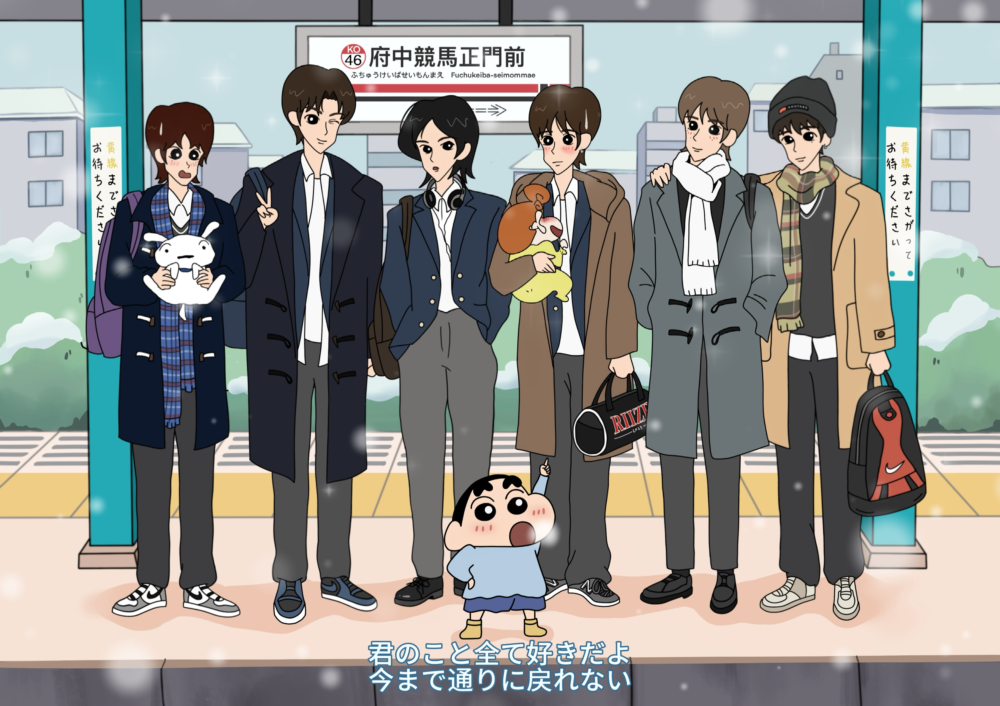

# こんにちは！WANG BEIYIです 🐼✨

🇨🇳 中国・四川省生まれ（パンダと麻婆豆腐のふるさと）  
🎓 成都理工大学 広告学専攻（学士）  
🎓 北海道大学大学院 修士課程 M1

---

## 🎨 趣味
- **デザインと絵描き**
  - [ゲーム系CGアート作品はこちら](https://www.ggac.com/work/detail/406353)
  - [グラフィックデザイン作品はこちら](https://mp.weixin.qq.com/s/kjHRJwrk5teJv_ApwJPC_w)

- **K-POP**  
  下のイラストは私が描いたファンアートです。さて、私が推しているのは誰でしょう…？🤭  
  

- **旅行**  
  行き先よりもご当地グルメ優先ですが、山や自然の風景を眺めるのも大好きです。  

- **運動スキル：ゼロ**  

- **食べ＆遊びスキル：カンスト** 🍜🎢

---

## 📚 研究・分析している＆興味のある分野
- 少年犯罪報道の研究  
- ジャーナリズム・ニュース  
- 広告  
- IP・キャラクター分野  

💬 同じ分野に興味のある方、ぜひ交流しましょう！

---

## 📩 連絡先
- **Email**: wangbeiyi9＠gmail.com  

---

気軽に話しかけてくださいね😊
